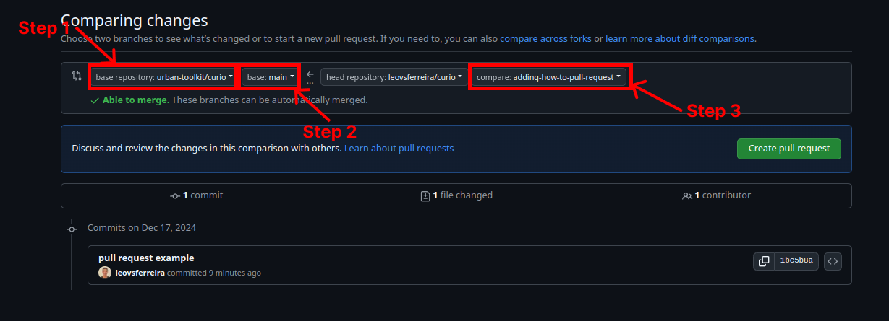

# How to make a contribution via Pull Requests

A Pull Request (PR) is the method used to propose changes to the codebase. It allows maintainers and other contributors to review your work, provide feedback, and, if it meets the project's guidelines, merge it into the main codebase.

## Steps to create a pull request

1. **Create a new branch for your work:**
   - From your local copy of the forked repository, create a branch describing the feature or fix you're working on:
     ```bash
     git checkout -b feature-branch-name
     ```
   
   - Keep branch names short and descriptive, for example: `fix-bug-issue-123` or `add-new-api-endpoint`.

2. **Make your changes:**
   - Edit code, add or modify files, and commit your changes.
   - Ensure commits have meaningful messages:
     ```bash
     git add .
     git commit -m "Add feature description or fix details"
     ```

3. **Push your branch to your fork:**
   - Once you're ready, push your branch to your fork on GitHub:
     ```bash
     git push origin feature-branch-name
     ```

4. **Open a Pull Request:**
   - Go to the page of your forked repository on GitHub.
   - You will see a banner prompting you to "Compare & pull request".
   - Click that link or navigate to the **"Pull Requests"** (Step 1 image below) tab and select **"New pull request"** (Step 2 image below).

    

   - Choose the correct base repository (Step 1 image below) and branch (i.e., the original repo's `main` branch - Step 2 image below) and compare with your fork's feature branch (Step 3 image below).

   

> [!IMPORTANT]
> Follow the instructions and use the correct template, as defined below.
    
   - Fill in the PR details using the template (see below).
   - Click **"Create pull request"** to submit.

## Defining the scope of a pull request

When creating a PR, it's important to have a clear, focused scope. Each PR should ideally address a single feature or issue. Avoid mixing unrelated changes as it makes the review process harder and less transparent. If you need to address multiple unrelated changes, create separate branches and PRs for each.

**Focus on:**
- One feature addition
- One bug fix
- One set of related documentation updates

If your PR grows beyond a single scope, consider splitting it into multiple PRs.

## Pull request template

To help maintain consistency and clarity, use the following template when creating a Pull Request:

```md
### Description
<!-- A brief description of what your PR does. Include the purpose and context. -->

### Related Issue
<!-- If this PR addresses an issue, provide the issue number or link. -->

### Changes
<!-- List the changes or additions you've made. For example:
- Added a new API endpoint to retrieve user profiles.
- Fixed a typo in the README.
-->

### Impact
<!-- Describe who will be affected by these changes and how. For instance:
- Users now have the ability to do X.
- Bug Y is no longer encountered.
-->

### Testing
<!-- Detail any steps or tests taken to ensure the code works as intended.
Include steps for reviewers to reproduce and verify your changes:
1. Run `npm install`
2. Run `npm test`
3. Confirm that all tests pass and the new feature works as expected.
-->

### Additional Notes
<!-- Any additional context, concerns, or follow-ups. For example, mention if docs need to be updated after merging. -->
